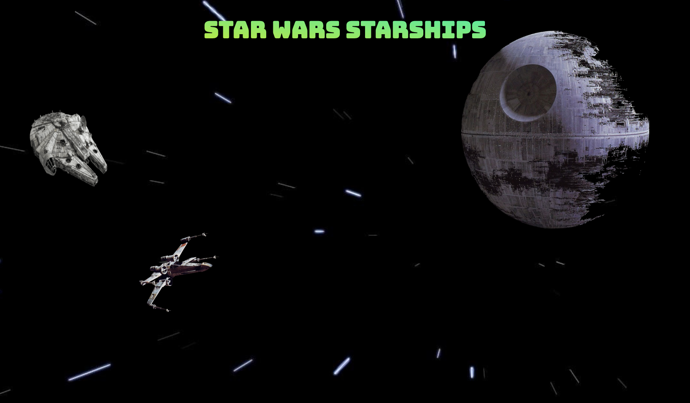
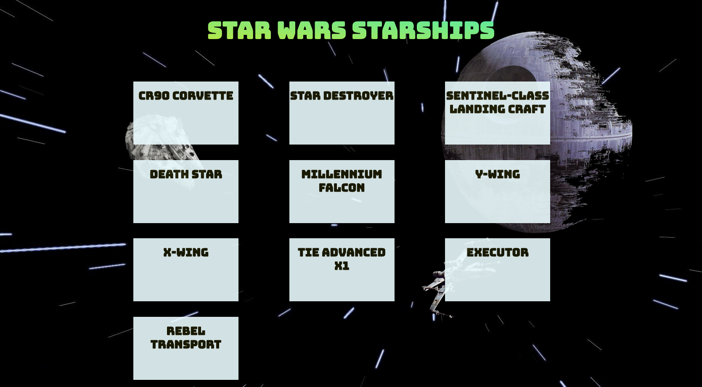

# [Star-Wars-Starships](https://gk-star-wars-starships.herokuapp.com/)
<!-- (https://ondarox-manager.herokuapp.com/) -->

A Star Wars Starships Landing Page with custom CSS animation and a 3rd party API.

## Technologies

- HTML5
- CSS3
- Sass
- JavaScript ES6
- Node.js
- React
- Google Fonts
- Swapi.dev API

## UI Screenshots

Diagram            | 
:-------------------------:|
  |
:-------------------------:|
  |
:-------------------------:|
  |

**Summary**

| Field | Detail |
|-------|--------|
| App Name | Star Wars Starships |
| Description | A Star Wars Starships Landing Page with custom CSS animation and a 3rd party API |
| Live Website | https://gk-star-wars-starships.herokuapp.com/ |
| Repo | https://github.com/germanokuerten/star-wars-api |

>"Simplicity Is the key to brilliance." - Bruce Lee